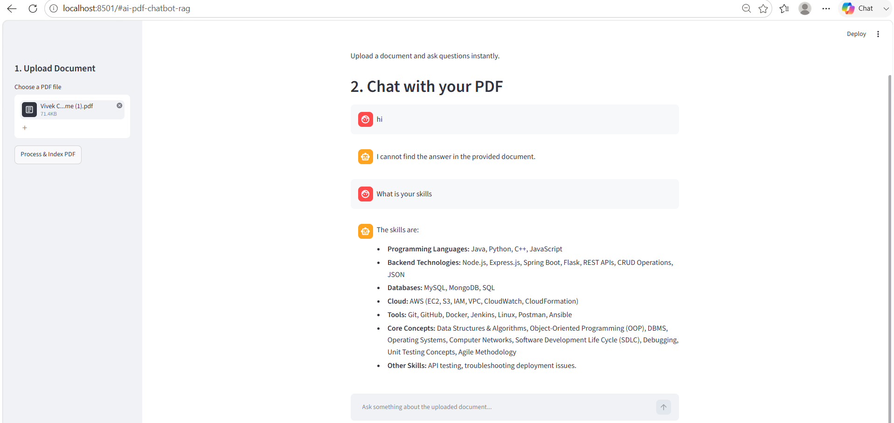

# 📄 AI PDF Chatbot (RAG System)

A fully functional, local **Retrieval-Augmented Generation (RAG)** chatbot application. This project enables users to upload any PDF document (like a resume, textbook, or manual) and have an interactive, context-aware chat session with it. 

Built with a fast decoupled backend API and a clean, reactive frontend user interface.

---

## 🚀 Features
* **Dynamic PDF Upload & Processing:** Uses `LangChain` to dynamically parse and split documents into optimized text chunks.
* **Local Vector Store:** Utilizes `FAISS` to store mathematical embeddings locally, ensuring quick retrieval without complex external database infrastructure.
* **Modern LLM Integration:** Integrated with Google's advanced `gemini-2.5-flash` for high-performance context processing and text generation.
* **Interactive UI:** A conversational interface built entirely with `Streamlit` featuring clean chat history formatting.
* **Decoupled Architecture:** Built using a high-performance `FastAPI` backend endpoint structure.

---

## 🛠️ Tech Stack
* **Backend:** Python, FastAPI, Uvicorn
* **AI/RAG:** LangChain, Google Gemini API, FAISS (Facebook AI Similarity Search)
* **Frontend:** Streamlit, Requests


---

## ⚙️ Setup and Installation

### 1. Clone the repository
```bash
git clone [https://github.com/vivek65666/pdf-ai-chatbot.git](https://github.com/vivek65666/pdf-ai-chatbot.git)
cd pdf-ai-chatbot
